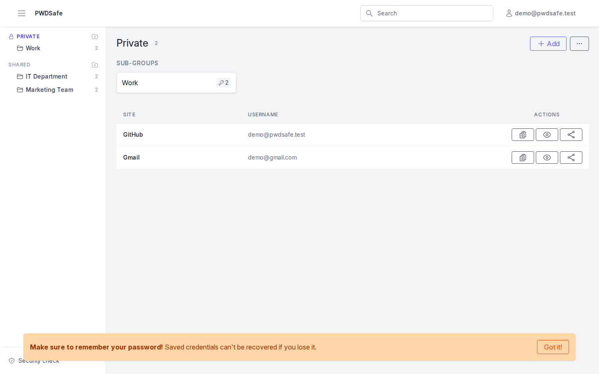
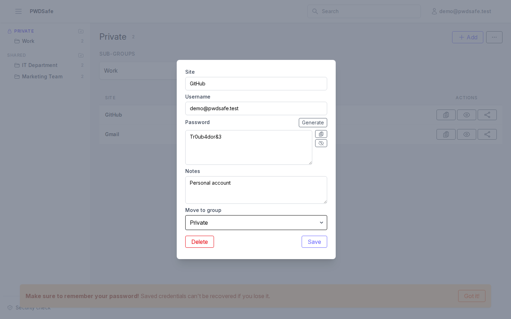
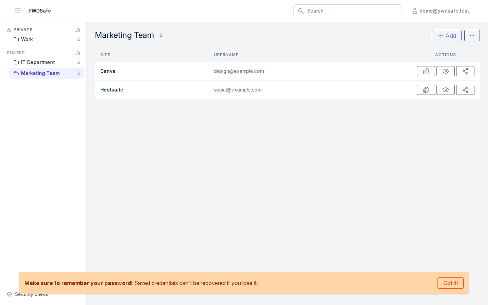
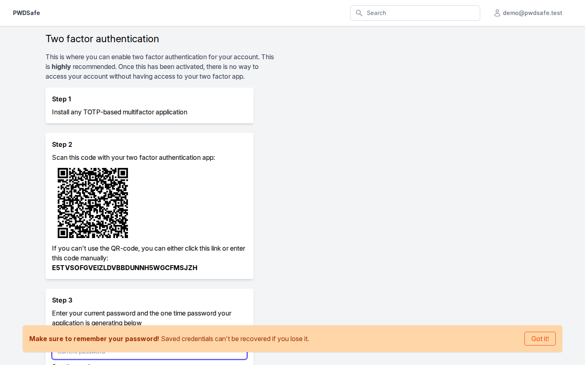
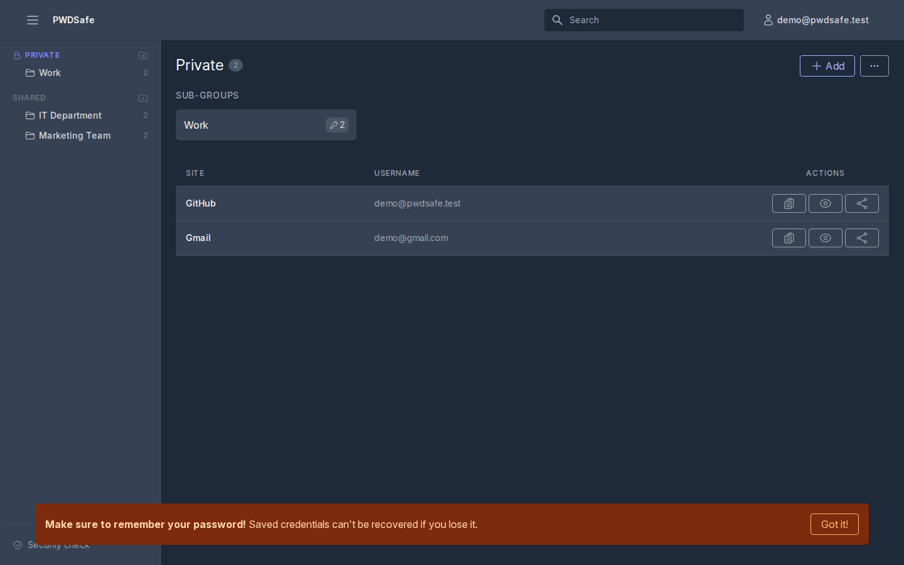

PWDSafe
=======

PWDSafe is a self-hosted, **zero-knowledge** password manager. It lets you
and your team store, organize and share credentials, while keeping the
server unable to read your passwords or private keys. Users can
authenticate with a local account, LDAP / Active Directory, or OIDC.

Screenshots
-----------
| Safe | Credential view | Shared group | Two-factor setup |
| --- | --- | --- | --- |
|  |  |  |  |

PWDSafe also supports dark mode, following your system preference:



Features
--------
- Zero-knowledge, client-side encrypted safe for your personal credentials
- Organize credentials into groups and subgroups, with shared groups for teams
- Share individual credentials with other users or via temporary public links
- Search across your safe
- Two-factor authentication (TOTP)
- Local accounts, LDAP / Active Directory, or OIDC login
- Built-in security check that flags reused passwords across your credentials
- REST API for the browser extension and other clients
- Admin panel for user and authentication management

Zero-knowledge encryption
--------------------------
PWDSafe is built so that the server never has access to your plaintext
passwords or encryption keys.

When you register, your browser generates an RSA-4096 key pair. The private
key is encrypted with a vault key that is derived from your password using
PBKDF2-SHA256 (600,000 iterations) and stored encrypted with AES-256-GCM —
only the encrypted blob is ever sent to the server. Your credentials are
encrypted client-side the same way: each credential is encrypted with
AES-256-GCM, and the AES key is wrapped with RSA-OAEP for every user who
should have access to it.

During login, your password never leaves the browser. Instead, a login hash
is derived from your password and sent to the server for authentication,
while the vault key (derived separately) is used locally to decrypt your
private key and unlock your safe.

This means that even an administrator with full database access cannot read
your stored passwords. It also means that **if you forget your password,
your existing credentials cannot be recovered**. An administrator can reset
your login so you can access PWDSafe again, but this starts you with a new,
empty safe — the credentials encrypted under your old private key remain
permanently inaccessible.

For the exact algorithms and data formats, see
[`app/Helpers/Encryption.php`](app/Helpers/Encryption.php) and
[`resources/js/vault.js`](resources/js/vault.js).

Installation
------------
### Production (Docker)
The recommended way to run PWDSafe in production is the published image on
[Docker Hub](https://hub.docker.com/r/pwdsafe/pwdsafe/tags). The image runs
migrations automatically on startup and serves the application on port
`8080`.

```
docker run -d \
  -p 8080:8080 \
  -e APP_KEY=base64:... \
  -e APP_URL=https://your-domain.example \
  -e DB_CONNECTION=mysql \
  -e DB_HOST=your-db-host \
  -e DB_DATABASE=pwdsafe \
  -e DB_USERNAME=pwdsafe \
  -e DB_PASSWORD=secret \
  pwdsafe/pwdsafe:<version>
```

Pick a specific version tag from [Docker Hub](https://hub.docker.com/r/pwdsafe/pwdsafe/tags)
rather than `latest`, so deployments stay reproducible.

Generate `APP_KEY` once (e.g. with `docker run --rm pwdsafe/pwdsafe:<version> php artisan key:generate --show`)
and keep it the same across deploys/restarts. See `.env.example` for further
configuration options (database, Sentry, etc.).

### Local development (Sail)
For local development, this project uses [Laravel Sail](https://laravel.com/docs/sail),
which is included as a dev dependency.

* Clone the repository
* Run `composer install`
* Copy `.env.example` to `.env` and configure it (database, mail, etc.)
* Run `php artisan key:generate`
* Start the containers with `vendor/bin/sail up -d`
* Run the database migrations with `vendor/bin/sail artisan migrate`
* Install frontend dependencies and build assets with `vendor/bin/sail npm install && vendor/bin/sail npm run build`
* Browse to your site, register and login. Enjoy!

`docker-compose.yml` also includes an OpenLDAP container, useful for testing
the LDAP integration during development. Uncomment the `init.ldif` volume
mount in `docker-compose.yml` to seed it with example users from
`docker/ldap/init.ldif`.

### Demo data

To try out PWDSafe with a populated safe, run the demo seeder:

```
vendor/bin/sail artisan db:seed
```

This creates a demo user (`demo@pwdsafe.test` / `DemoPassword123!`) with a
working zero-knowledge safe, a "Work" subgroup and a few sample
credentials, plus a colleague account (`colleague@pwdsafe.test` /
`DemoPassword123!`) and two shared groups ("Marketing Team" and "IT
Department") with credentials shared between the two users.

Manual installation
--------------------
If you prefer to run PWDSafe on your own webserver instead of Docker:

* Webserver with support for PHP 8.5 and modules:
  - ldap
  - openssl
  - json
  - mbstring
  - pdo_mysql
  - pdo_pgsql
* Access to a MySQL or PostgreSQL database
* Composer and Node.js

Steps:
* Run `composer install`
* Run `npm install && npm run build`
* Copy `.env.example` to `.env`, run `php artisan key:generate` and configure it
* Run the database migrations with `php artisan migrate`
* Configure your webserver so it points to the `public/` folder. Make sure
  to redirect all requests where the file requested does not exist to
  `index.php`. Example configuration for nginx:
```Nginx
location / {
    try_files $uri $uri/ /index.php?$args;
}
```
* Browse to your site, register and login. Enjoy!

Upgrading
---------
* Pull down the latest tag from the repository
* Run `composer install`
* Run `npm install && npm run build`
* Run any outstanding migrations by executing `php artisan migrate`

Extra configuration
--------------------
### Admin access
LDAP / Active Directory and OIDC are configured by an administrator from the
admin panel, not via environment variables. To access the admin panel for
the first time, promote an existing user to admin from the command line:

```
php artisan pwdsafe:make-admin user@example.com
```

### Sentry
You can configure error tracking with Sentry by configuring the required
env-variables. See `.env.example` for placeholders.

Companion CLI
-------------
A command-line client for PWDSafe is available at
[PWDSafe/pwdsafe-cli](https://github.com/PWDSafe/pwdsafe-cli), built on top
of the REST API.

This application uses
----------------------
The following libraries/frameworks are used by the application:
- Laravel - https://laravel.com/
- Vue - https://vuejs.org/
- Tailwind CSS - https://tailwindcss.com/
- Heroicons - https://heroicons.com/
